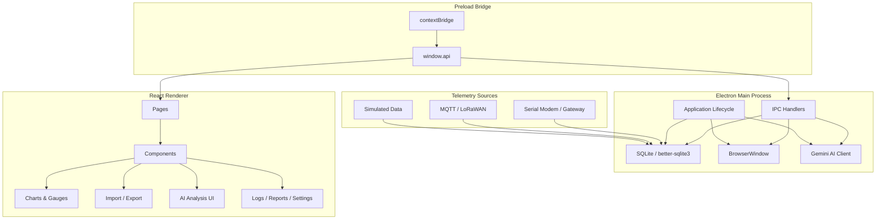
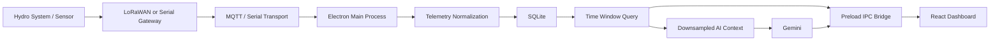
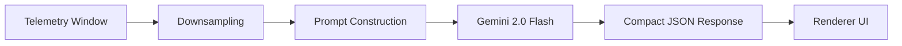
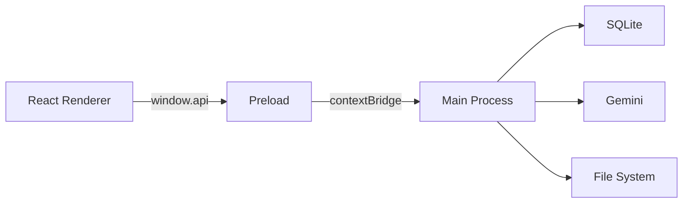

<div align="center">

# HydroSense Desktop

### Real-Time Hydro System Monitoring, Analytics & AI-Assisted Reporting

<p align="center">
  
  
  
  
  
</p>

<p align="center">
  
  
  
  
  
  
</p>

<p align="center">
  <strong>HydroSense Desktop</strong> is a cross-platform Electron application for real-time hydro-system monitoring, multi-signal analysis, local/offline data storage, and AI-assisted operational insights.
</p>

<p align="center">
  <a href="#-overview">Overview</a> •
  <a href="#-features">Features</a> •
  <a href="#-architecture">Architecture</a> •
  <a href="#-tech-stack">Tech Stack</a> •
  <a href="#-getting-started">Getting Started</a> •
  <a href="#-configuration">Configuration</a> •
  <a href="#-telemetry-ingestion">Telemetry</a> •
  <a href="#-ipc-api">IPC API</a> •
  <a href="#-security">Security</a>
</p>

</div>

---

## 📌 Overview

HydroSense Desktop is designed as a local-first monitoring and analytics client for hydro systems.

The application combines:

- 📊 Real-time dashboards and multi-signal charts
- 🤖 AI-assisted analysis using Gemini
- 💾 Offline-first SQLite persistence
- 🔐 Secure Electron IPC boundaries
- 📥 JSON import and 📤 CSV / XLSX / JSON export
- 📡 A telemetry ingestion layer designed for LoRaWAN/MQTT or direct serial gateways
- 📦 Cross-platform packaging for Linux and Windows

The current application ships with simulated telemetry data. The architecture also provides integration paths for real-world telemetry ingestion through MQTT-based LoRaWAN network servers and direct serial modem/gateway connections.

> **Implementation note:** The current database contains a simulated `template_samples` dataset. A dedicated timestamp-keyed `telemetry` table is provided as the recommended production direction for real device data.

---

## 🧭 Table of Contents

- [Overview](#-overview)
- [Features](#-features)
- [Application Capabilities](#-application-capabilities)
- [Architecture](#-architecture)
- [Data Flow](#-data-flow)
- [Tech Stack](#-tech-stack)
- [Project Structure](#-project-structure)
- [Getting Started](#-getting-started)
- [Build & Packaging](#-build--packaging)
- [Configuration](#-configuration)
- [Database](#-database)
- [Telemetry Ingestion](#-telemetry-ingestion)
- [IPC API](#-ipc-api)
- [AI Analysis](#-ai-analysis)
- [Security](#-security)
- [Scripts](#-scripts)
- [Troubleshooting](#-troubleshooting)
- [Development Notes](#-development-notes)
- [Roadmap](#-roadmap)
- [License](#-license)
- [Maintainers](#-maintainers)

---

## ✨ Features

| Capability | Description |
|---|---|
| 📈 **Real-Time Monitoring** | Multi-signal dashboards for RPM, vibration, temperature, water pressure, water speed, and related telemetry |
| 📊 **Rich Visualization** | Interactive charts and gauges built with React and Recharts |
| 🤖 **AI-Powered Analysis** | Gemini-powered analysis returning concise, actionable model output |
| 💾 **Offline-First Storage** | Local SQLite persistence with WAL mode for local operation |
| 🔄 **Data Import / Export** | Import JSON and export CSV, XLSX, and JSON |
| 🔐 **Secure IPC** | Renderer communicates with privileged Electron functionality through a preload bridge |
| 🌐 **Cross-Platform** | Linux packages (`deb`, `AppImage`) and Windows portable builds |
| 📡 **Telemetry Ready** | MQTT/LoRaWAN and serial gateway integration paths are documented |
| 🧩 **Extensible Architecture** | Main, preload, and renderer layers are intentionally separated |

---

## 🖥️ Application Capabilities

### Dashboard

The dashboard layer is intended to provide a single operational view of incoming hydro-system signals, including:

- RPM
- Piezo vibration
- SW-420 vibration
- Weight
- Speed
- Acceleration
- Temperature
- Water pressure
- Water speed
- Water temperature

### Analysis

The analysis layer provides time-windowed telemetry visualization and supports AI-assisted interpretation of the selected data window.

### Import & Export

HydroSense supports:

```text
JSON  → Import
CSV   → Export
XLSX  → Export
JSON  → Export
```

### Offline-First Operation

Telemetry and application data can be stored locally in SQLite. The database uses WAL mode, allowing the application to operate without requiring a continuously available remote database.

---

## 🏗️ Architecture

HydroSense follows a standard secure Electron architecture:



### Process Responsibilities

| Layer | Responsibility |
|---|---|
| **Main Process** | Database access, application lifecycle, file dialogs, telemetry integration, AI requests |
| **Preload** | Exposes a controlled `window.api` bridge using `contextBridge` |
| **Renderer** | React UI, dashboards, charts, gauges, import/export workflows, AI presentation, logs, reports, settings |

### Security Boundary

The renderer does **not** directly access Node.js APIs. Privileged functionality is intentionally kept behind the preload bridge.

---

## 🔄 Data Flow

A typical telemetry path can be represented as:



For development, simulated 24-hour seed data can be used without a physical telemetry source.

---

## 🧰 Tech Stack

### Core

| Technology | Version / Role |
|---|---|
| **Electron** | 37 — desktop runtime |
| **TypeScript** | 5 — application language |
| **Vite** | 7 — renderer development/build tooling |
| **tsup** | Main/preload bundling |
| **React** | 19 — UI |
| **React Router** | 7 — client-side routing |

### UI & Visualization

| Technology | Role |
|---|---|
| **Tailwind CSS** | Utility-first styling |
| **Framer Motion** | UI animation |
| **Recharts** | Charts and telemetry visualization |
| **lucide-react** | Icon system |

### Data & Integration

| Technology | Role |
|---|---|
| **SQLite / better-sqlite3** | Local persistence |
| **date-fns** | Date/time handling |
| **PapaParse** | CSV processing |
| **xlsx** | Excel import/export |
| **Gemini 2.0 Flash** | AI analysis |
| **MQTT** | LoRaWAN network-server integration path |
| **serialport** | Direct serial gateway integration path |

### Packaging

| Tool | Output |
|---|---|
| **electron-builder** | Application packaging |
| Linux | `.deb`, `.AppImage` |
| Windows | Portable executable |

---

## 📁 Project Structure

```text
HydroSense-Desktop/
├── index.html
├── package.json
│
└── src/
    ├── main/
    │   ├── db.ts
    │   └── main.ts
    │
    ├── preload/
    │   └── preload.ts
    │
    └── renderer/
        ├── assets/
        ├── components/
        ├── lib/
        ├── pages/
        ├── store/
        ├── types/
        └── ui/
```

### Directory Responsibilities

```text
main/       → Electron main process, database, IPC, integrations
preload/    → Secure renderer ↔ main bridge
renderer/   → React application and UI
components/ → Reusable application components
pages/      → Route-level screens
store/      → Client-side application state
types/      → Shared renderer-side type definitions
ui/         → UI primitives
lib/        → Supporting utilities and helpers
assets/     → Static renderer assets
```

---

## 🚀 Getting Started

### Prerequisites

| Requirement | Minimum | Recommended |
|---|---:|---:|
| Node.js | 18+ | 20 LTS |
| npm | 9+ | Latest compatible version |

### 1. Clone the repository

```bash
git clone <YOUR_REPOSITORY_URL>
cd HydroSense-Desktop
```

> Replace `<YOUR_REPOSITORY_URL>` with the actual repository URL.

### 2. Install dependencies

```bash
npm install
```

### 3. Configure Gemini

Linux/macOS:

```bash
export HYDROSENSE_GEMINI_API_KEY="<YOUR_GEMINI_API_KEY>"
```

Windows PowerShell:

```powershell
$env:HYDROSENSE_GEMINI_API_KEY="<YOUR_GEMINI_API_KEY>"
```

### 4. Start development

```bash
npm run dev
```

The development environment uses:

```text
Vite Dev Server → http://localhost:5173
tsup            → Main + Preload watch build
Electron        → Desktop application
```

---

## 📦 Build & Packaging

### Production build

```bash
npm run build
```

### Linux

```bash
npm run package:linux
```

Produces:

```text
.deb
.AppImage
```

### Windows

```bash
npm run package:win
```

Produces a portable Windows build.

The configured product name is:

```text
HydroSense
```

---

## ⚙️ Configuration

Environment variables are read by the Electron **main process**.

| Variable | Required | Description | Example |
|---|---|---|---|
| `HYDROSENSE_GEMINI_API_KEY` | AI: Yes | Gemini API key | `<GEMINI_API_KEY>` |
| `HYDROSENSE_MQTT_URL` | No | MQTT broker URL | `mqtts://eu1.cloud.thethings.network` |
| `HYDROSENSE_MQTT_USERNAME` | No | MQTT / TTN application identifier | `<APP_ID>` |
| `HYDROSENSE_MQTT_PASSWORD` | No | MQTT / TTN API key | `<TTN_API_KEY>` |
| `HYDROSENSE_SERIAL_PATH` | No | Serial modem/gateway device path | `/dev/ttyUSB0` |
| `HYDROSENSE_SERIAL_BAUD` | No | Serial baud rate | `9600` |

### Example

```bash
export HYDROSENSE_GEMINI_API_KEY="..."
export HYDROSENSE_MQTT_URL="mqtts://eu1.cloud.thethings.network"
export HYDROSENSE_MQTT_USERNAME="..."
export HYDROSENSE_MQTT_PASSWORD="..."
export HYDROSENSE_SERIAL_PATH="/dev/ttyUSB0"
export HYDROSENSE_SERIAL_BAUD="9600"
```

> **Security warning:** Do not commit API keys, broker credentials, or device credentials to source control.

---

## 🗄️ Database

### Engine

```text
SQLite
└── better-sqlite3
    └── WAL enabled
```

### Database location

```text
${app.getPath('userData')}/data/appdata.db
```

### Current dataset

The current implementation includes:

```text
template_samples
```

with simulated 24-hour seed data.

### Recommended production telemetry table

```sql
CREATE TABLE IF NOT EXISTS telemetry (
    ts INTEGER PRIMARY KEY,
    rpm REAL,
    vibration_piezo REAL,
    vibration_sw420 REAL,
    weight REAL,
    speed REAL,
    acceleration REAL,
    temperature REAL,
    water_pressure REAL,
    water_speed REAL,
    water_temperature REAL
);
```

### Sample insert

```ts
export function insertSample(s: {
  ts: number
  rpm: number
  vibration_piezo: number
  vibration_sw420: number
  weight: number
  speed: number
  acceleration: number
  temperature: number
  water_pressure: number
  water_speed: number
  water_temperature: number
}) {
  db.prepare(`
    INSERT OR REPLACE INTO telemetry
      (
        ts,
        rpm,
        vibration_piezo,
        vibration_sw420,
        weight,
        speed,
        acceleration,
        temperature,
        water_pressure,
        water_speed,
        water_temperature
      )
    VALUES (
      @ts,
      @rpm,
      @vibration_piezo,
      @vibration_sw420,
      @weight,
      @speed,
      @acceleration,
      @temperature,
      @water_pressure,
      @water_speed,
      @water_temperature
    )
  `).run(s)
}
```

### Storage design direction

For production telemetry, the recommended direction is:

```text
Device
  ↓
Telemetry ingestion
  ↓
Normalization / validation
  ↓
telemetry(timestamp-keyed rows)
  ↓
indexed time-window queries
  ↓
Dashboard / Export / AI
```

---

## 📡 Telemetry Ingestion

HydroSense currently ships with simulated data. Real telemetry can be integrated through either of the following documented paths.

### Option A — LoRaWAN Network Server via MQTT

Compatible integration examples include:

- The Things Stack / TTN
- ChirpStack
- Other MQTT-compatible LoRaWAN network servers

#### Install

```bash
npm i mqtt
```

#### Connection example

```ts
import mqtt from 'mqtt'
import { insertSample } from './db'

export function startMqtt() {
  const url =
    process.env.HYDROSENSE_MQTT_URL ||
    'mqtts://eu1.cloud.thethings.network'

  const client = mqtt.connect(url, {
    username: process.env.HYDROSENSE_MQTT_USERNAME,
    password: process.env.HYDROSENSE_MQTT_PASSWORD,
    protocolVersion: 4
  })

  client.on('connect', () => {
    const appId = process.env.HYDROSENSE_MQTT_USERNAME
    client.subscribe(`v3/${appId}@ttn/devices/+/up`)
  })

  client.on('message', (_topic, msg) => {
    const json = JSON.parse(msg.toString())
    const p = json.uplink_message?.decoded_payload

    if (!p) return

    insertSample({
      ts: Date.now(),
      rpm: p.rpm,
      vibration_piezo: p.vib_piezo,
      vibration_sw420: p.vib_sw420,
      weight: p.weight,
      speed: p.speed,
      acceleration: p.accel,
      temperature: p.temp,
      water_pressure: p.water_p,
      water_speed: p.water_v,
      water_temperature: p.water_t
    })
  })
}
```

### Option B — Direct Serial Modem / Gateway

#### Install

```bash
npm i serialport
```

#### Example

```ts
import { SerialPort } from 'serialport'
import { insertSample } from './db'

export function startSerial() {
  const path =
    process.env.HYDROSENSE_SERIAL_PATH || '/dev/ttyUSB0'

  const baudRate =
    Number(process.env.HYDROSENSE_SERIAL_BAUD || 9600)

  const port = new SerialPort({
    path,
    baudRate
  })

  let buffer = ''

  port.on('data', data => {
    buffer += data.toString()

    let idx

    while ((idx = buffer.indexOf('\n')) >= 0) {
      const line = buffer.slice(0, idx).trim()
      buffer = buffer.slice(idx + 1)

      try {
        const p = JSON.parse(line)

        insertSample({
          ts: Date.now(),
          rpm: p.rpm,
          vibration_piezo: p.vib_piezo,
          vibration_sw420: p.vib_sw420,
          weight: p.weight,
          speed: p.speed,
          acceleration: p.accel,
          temperature: p.temp,
          water_pressure: p.water_p,
          water_speed: p.water_v,
          water_temperature: p.water_t
        })
      } catch {
        // Invalid serial payload
      }
    }
  })
}
```

### After ingestion is enabled

The query layer should read from the `telemetry` table using timestamp-based windows.

---

## 🔌 IPC API

The renderer communicates with Electron main through `window.api`.

| Method | Signature | Purpose |
|---|---|---|
| `openFile()` | `Promise<{ path: string; text: string } \| null>` | Open a file dialog and read file content |
| `saveFile(payload)` | `Promise<string \| null>` | Save to a selected or provided path |
| `fetchWindow(seconds)` | `Promise<Row[]>` | Fetch a rolling telemetry window |
| `aiGenerate(payload)` | `Promise<string>` | Send AI request through the main process |

### `Row` shape

```ts
type Row = {
  ts: number
  rpm: number
  vibration_piezo: number
  vibration_sw420: number
  weight: number
  speed: number
  acceleration: number
  temperature: number
  water_pressure: number
  water_speed: number
  water_temperature: number
}
```

### Example

```ts
const rows = await window.api.fetchWindow(600)
```

The example above requests the last 10 minutes of telemetry.

---

## 🤖 AI Analysis

HydroSense uses **Gemini 2.0 Flash** through the Electron main process.

### Analysis pipeline



The documented analysis approach uses a downsampled telemetry window, for example:

```text
Last 10 minutes
      ↓
30-second interval
      ↓
Compact AI context
```

### Renderer-side example

```ts
const text = await window.api.aiGenerate({
  system: systemPrompt,
  messages: [
    {
      role: 'user',
      content: instruction
    }
  ]
})
```

### AI security boundary

The Gemini API key must remain in the **main process** and must never be exposed to the renderer or bundled frontend code.

---

## 🔐 Security

HydroSense uses Electron's process isolation model as an explicit security boundary.

### Required security properties

```text
contextIsolation: true
nodeIntegration: false
API key: main process only
Renderer: no direct Node.js access
IPC: controlled preload bridge
```

### Secure architecture



### Credential rules

Never hard-code:

- Gemini API keys
- MQTT passwords
- TTN API keys
- Device credentials
- Production secrets

Use environment variables or an appropriate secure credential mechanism.

### Input handling

Any user-controlled data rendered as HTML should be sanitized. A library such as `DOMPurify` can be used when HTML rendering is actually required.

---

## 🧪 Development Notes

### Development mode

The development workflow combines:

```text
Vite
  +
tsup watch
  +
Electron
```

### Useful local checks

Before opening a pull request, verify:

```bash
npm run build
```

and confirm that:

- the renderer builds correctly,
- main/preload bundles build correctly,
- Electron starts without runtime IPC errors,
- database access works,
- AI requests fail safely when the key is absent,
- imported/exported files preserve expected data.

---

## 📜 Scripts

| Command | Purpose |
|---|---|
| `npm run dev` | Start Vite, tsup watch mode, and Electron |
| `npm run build` | Production build |
| `npm run package:linux` | Build Linux `deb` and AppImage packages |
| `npm run package:win` | Build Windows portable package |
| `npm start` | Start packaged app in development context |

---

## 🛠️ Troubleshooting

### Blank window during development

Check that Vite is available on:

```text
http://localhost:5173
```

Also verify that the `wait-on tcp:5173` step resolves successfully.

### GPU flicker

The application disables GPU VSync and hardware acceleration through Electron configuration:

```ts
app.commandLine.appendSwitch('disable-gpu-vsync')
disableHardwareAcceleration()
```

### SQLite locked

Possible causes include:

- multiple application instances,
- another process holding the database,
- incorrect connection lifecycle,
- concurrent access without the expected SQLite setup.

WAL mode is enabled in the documented architecture.

### Missing AI key

Set:

```bash
export HYDROSENSE_GEMINI_API_KEY="<YOUR_GEMINI_API_KEY>"
```

before starting:

```bash
npm run dev
```

or:

```bash
npm start
```

---

## 🧩 Production Considerations

The current README and implementation establish the integration path, but several areas should be treated as production-hardening work rather than assumed to be complete.

### Telemetry

For real device deployments, consider adding:

```text
Payload validation
Schema versioning
Timestamp normalization
Device identity
Connection health
Reconnect strategy
Retry/backoff
Malformed-payload handling
```

### Storage

For long-running installations:

```text
Indexes on time-based queries
Retention policies
Data compaction
Archival
Telemetry partitioning strategy where appropriate
```

### AI

For operational AI analysis:

```text
Strict response schema validation
Timeouts
Retry policy
Rate-limit handling
Prompt versioning
Model abstraction
PII / sensitive-data controls where applicable
```

### Desktop reliability

For production desktop deployments:

```text
Single-instance enforcement
Crash recovery
Structured logging
Auto-update strategy
Signed binaries
Versioned migrations
```

These items are presented as engineering considerations and do not imply that they are already implemented.

---

## 🗺️ Roadmap

The current documented roadmap includes:

- [ ] First-class telemetry ingestion via MQTT + Serial
- [ ] Configurable telemetry decoders
- [ ] Long-term storage and retention policies
- [ ] Indexing for analytics windows
- [ ] Threshold-based alerting and notifications
- [ ] Rules engine
- [ ] Improved AI prompts
- [ ] AI model selection
- [ ] Role-based export permissions
- [ ] Audit logs

### Suggested evolution path

```text
Current
  │
  ├── Simulated telemetry
  ├── Local SQLite
  ├── Dashboard
  └── Gemini analysis
        │
        ▼
Integration
  │
  ├── MQTT / LoRaWAN
  ├── Serial gateway
  ├── Real telemetry schema
  └── Validation / reconnect handling
        │
        ▼
Production
  │
  ├── Retention & indexing
  ├── Alerting
  ├── Auditability
  ├── Signed releases
  └── Operational hardening
```

---

## 📚 Reference Design

### Logical component map

```text
┌─────────────────────────────────────────────────────────┐
│                 HYDROSENSE DESKTOP                      │
├─────────────────────────────────────────────────────────┤
│                    React Renderer                       │
│  Dashboard │ Analysis │ Reports │ Logs │ Settings      │
├─────────────────────────────────────────────────────────┤
│                    Preload Bridge                       │
│                  window.api / IPC                       │
├─────────────────────────────────────────────────────────┤
│                  Electron Main Process                  │
│   SQLite │ File System │ Telemetry │ Gemini │ Lifecycle │
├─────────────────────────────────────────────────────────┤
│                  Local / External Inputs                │
│   Simulated Data │ MQTT/LoRaWAN │ Serial Gateway        │
└─────────────────────────────────────────────────────────┘
```

---

## 📄 License

HydroSense Desktop is released under the **ISC License**.

See the `license` field in `package.json` for the project license declaration.

---

## 👥 Maintainers

**HydroSense**

```text
support@hydrosense.local
```

---

<div align="center">

### HydroSense Desktop

**Monitor. Analyze. Understand.**

<p>
  
  
  
</p>

</div>
